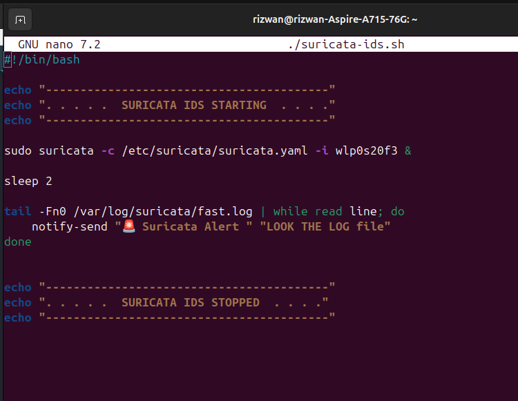
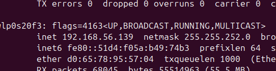
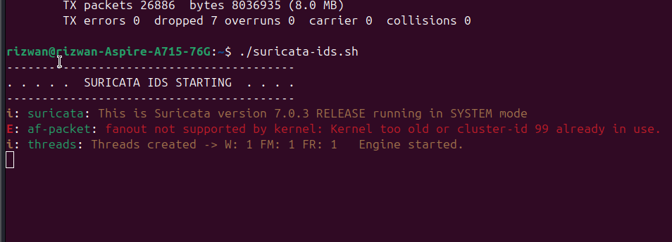
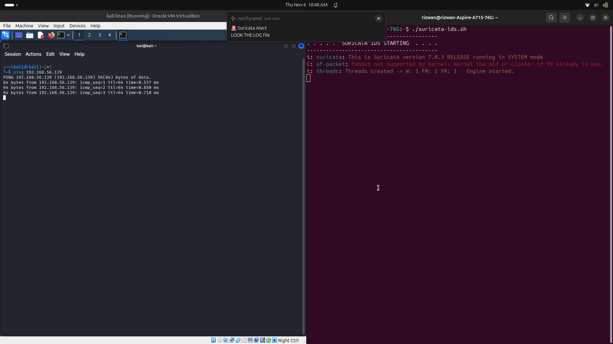
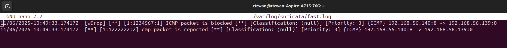

# Understanding IDS and Suricata

## What is an IDS (Intrusion Detection System)?

An IDS is a security tool that monitors network traffic to detect suspicious activities or potential threats. Think of it as a "security camera" for your computer network, alerting you when something unusual happens.

## Why Use an IDS?

- Protects your system from unauthorized access
- Detects and alerts you about potential threats
- Helps in investigating and preventing cyber attacks

---

# Setting Up Suricata IDS

Suricata is a popular open-source IDS. Below are the short and simple steps to install and use Suricata:

## 1. Install Suricata

On Ubuntu/Debian:
```sh
sudo apt update
sudo apt install suricata
```

## 2. Add a Simple Rule

1. Open the rules file:
    ```sh
    sudo nano /etc/suricata/rules/local.rules
    ```
2. Add this rule to alert on ICMP (ping) packets:
    ```
    alert icmp any any -> any any (msg:"ICMP Packet Detected"; sid:1000001; rev:1;)
    ```

## 3. Update Suricata's Configuration

Include your rule file by ensuring this line is present in `/etc/suricata/suricata.yaml`:
```
- local.rules
```

## 4. Start Suricata

```sh
sudo suricata -c /etc/suricata/suricata.yaml -i <your-network-interface>
# Example: sudo suricata -c /etc/suricata/suricata.yaml -i eth0
```

---

# Using Suricata to Detect Attacks

## Step 1: Start Suricata

Use the command above to run Suricata with your rules.

## Step 2: Generate Network Traffic

From another machine (e.g., Kali Linux VM), send a ping to your IDS-protected system:
```sh
ping <your system's IP address>
```

## Step 3: View Alerts

Check the alert log to see if Suricata detected the ping:
```sh
sudo tail -f /var/log/suricata/fast.log
```

---

## Try it Yourself!

**You can simply download my code and run it!**

---

### 1. Start - Suricata Setup



---

### 2. Check Your IP



---

### 3. Suricata Running



---

### 4. Ping from Kali Linux VM



---

### 5. Alert Triggered



---

**That's it! You have a basic IDS running using Suricata.**